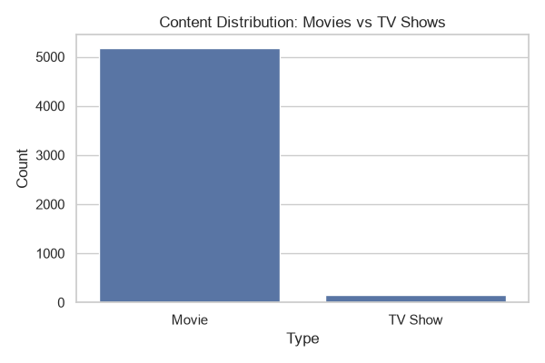
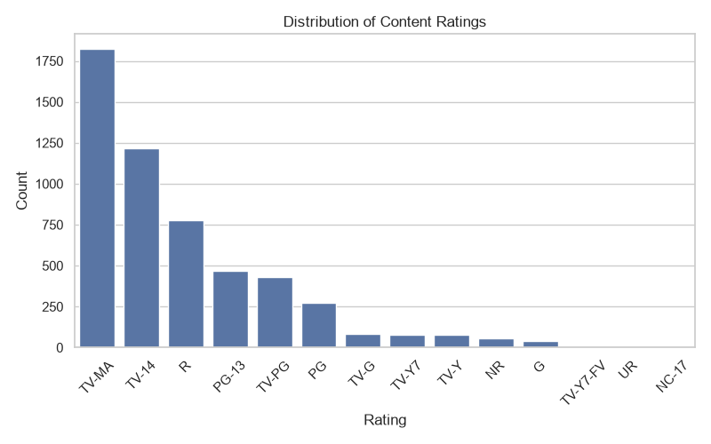
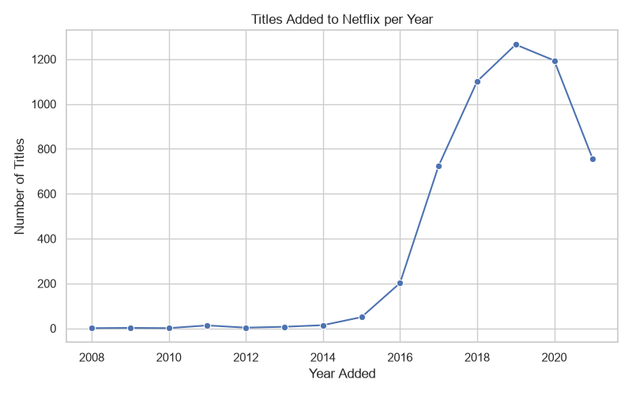

# Netflix Titles - Exploratory Data Analysis (EDA)

Exploratory Data Analysis on the Netflix titles dataset (8,807 Movies & TV
Shows), covering dataset structure, data cleaning, and content trends such
as Movie vs. TV Show distribution, ratings, genres, directors, and titles
added per year.

## Dataset

[`data/netflix_titles.csv`](data/netflix_titles.csv) contains metadata for
titles available on Netflix, with columns:

| Column | Description |
|---|---|
| `show_id` | Unique ID for the title |
| `type` | Movie or TV Show |
| `title` | Title name |
| `director` | Director(s) |
| `cast` | Main cast |
| `country` | Country/countries of production |
| `date_added` | Date the title was added to Netflix |
| `release_year` | Year the title was originally released |
| `rating` | Content rating (e.g. TV-MA, PG-13) |
| `duration` | Duration in minutes (Movies) or seasons (TV Shows) |
| `listed_in` | Genre(s) |
| `description` | Short synopsis |

## Analysis

The analysis is available both as a script, [`netflix_eda.py`](netflix_eda.py),
and as the original notebook, [`notebooks/netflix_eda.ipynb`](notebooks/netflix_eda.ipynb).
Both walk through:

1. **Understanding the dataset** - shape, data types, unique value counts,
   and missing values per column.
2. **Data cleaning** - dropping rows with missing `director`/`cast`/
   `country`/`rating` (each under 50% missing, and not suited to mean/
   median/mode imputation since they're categorical/text fields), and
   converting `date_added` to a proper datetime type.
3. **Content trends** - Movie vs. TV Show distribution, rating
   distribution, unique genre count, titles per director, and titles added
   per year.

Charts generated by the script are saved to [`images/`](images).

| Content Distribution | Ratings Distribution | Titles Added per Year |
|---|---|---|
|  |  |  |

## Key Findings

- The catalog is dominated by **Movies** (~97%) over **TV Shows** (~3%)
  after cleaning.
- **TV-MA** and **TV-14** are the most common ratings, indicating a
  catalog skewed toward mature/teen audiences.
- The dataset spans **42 unique genres**.
- Title additions grew sharply from 2015 onward, peaking around
  2018-2019.

## Getting Started

### Prerequisites

- Python 3.9+

### Setup

```bash
git clone https://github.com/<your-username>/Netflix_Dataset_EDA.git
cd Netflix_Dataset_EDA
pip install -r requirements.txt
```

### Run

```bash
python netflix_eda.py
```

This prints the analysis to the console and (re)generates the charts in
`images/`.

Alternatively, open [`notebooks/netflix_eda.ipynb`](notebooks/netflix_eda.ipynb)
in Jupyter to step through the same analysis interactively.

## Project Structure

```
Netflix_Dataset_EDA/
├── data/
│   └── netflix_titles.csv        # Dataset
├── docs/
│   └── Netflix_Business_Case_Study.pdf   # Business case study brief
├── notebooks/
│   └── netflix_eda.ipynb         # Original notebook version
├── images/                       # Generated charts
├── netflix_eda.py                # EDA script
├── requirements.txt
├── LICENSE
└── README.md
```

## License

This project is licensed under the MIT License - see [LICENSE](LICENSE)
for details.
